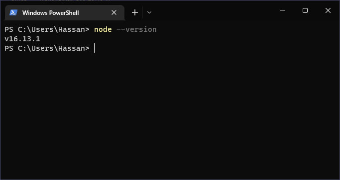

# Exercises No. 1

## Problem Statement:-

- Install [Node.js](https://nodejs.org/en/) and [VS Code](https://code.visualstudio.com/) on your computer.

## Solution:-

- Download NodeJs from the official site and after installation test it by running following command in the terminal.

  ```
  node --version
  ```

  if installed properly an output in the following format will be visible in the terminal window

  ```
  v16.13.1
  ```

  

- Download VS Code from the official site and after installation test it by running following command in the terminal.

  ```
  code .
  ```

  if installed properly VS code will open

  
