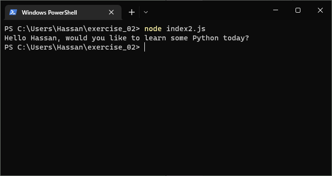
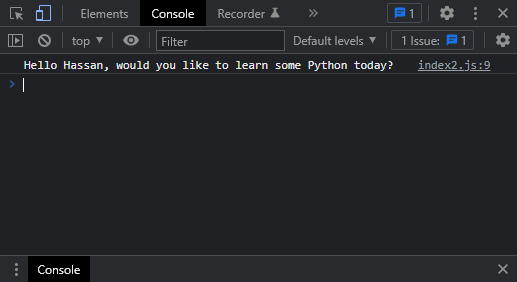

# Exercises No. 2

## Problem Statement:-

- Personal Message: Store a person's name in a variable, and print a message to that person. Your message should be simple, such as, "Hello Eric, would you like to learn some Python today?"

## Solution:-

- Create a file `index2.js` with the following content

  

- Run the code by using following command in terminal

  ```
  node index2.js
  ```

- Output in the terminal will be as follows

  

- To run the code in the browser create an HTML file `index2.html` and link JS file with it using following piece of code

  ```html
  <script src="./index2.js"></script>
  ```

- Open `index2.html` in browser and navigate to console. Same output can be seen there.

  
