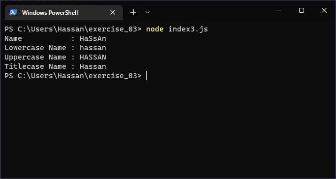

# Exercises No. 3

## Problem Statement:-

- Name Cases:
  Store a person’s name in a variable,
  and then print that person’s name in
  lowercase, uppercase, and titlecase.

## Solution:-

- Create a file `index3.js` with the following content

  

- Run the code by using following command in terminal

  ```
  node index3.js
  ```

- Output in the terminal will be as follows

  

- To run the code in the browser create an HTML file `index3.html` and link JS file with it using following piece of code

  ```html
  <script src="./index3.js"></script>
  ```

- Open `index3.html` in browser and navigate to console. Same output can be seen there.

  
