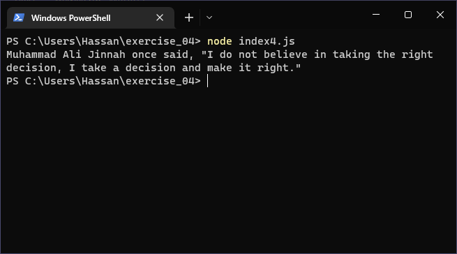
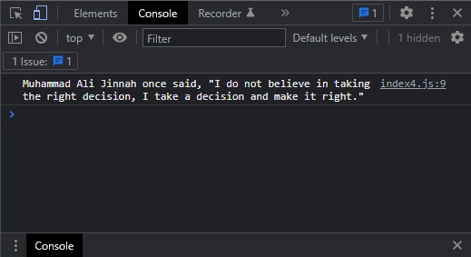

# Exercises No. 4

## Problem Statement:-

- Famous Quote: Find a quote from a famous person you admire.
  Print the quote and the name of its author.
  Your output should look something like the following, including the quotation marks:
  - Albert Einstein once said, "A person who never made a mistake never tried anything new."

## Solution:-

- Create a file `index4.js` with the following content

  

- Run the code by using following command in terminal

  ```
  node index4.js
  ```

- Output in the terminal will be as follows

  

- To run the code in the browser create an HTML file `index4.html` and link JS file with it using following piece of code

  ```html
  <script src="./index4.js"></script>
  ```

- Open `index4.html` in browser and navigate to console. Same output can be seen there.

  
