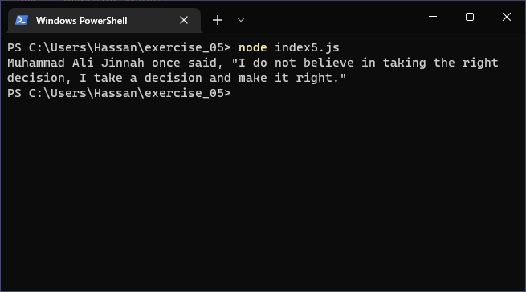

# Exercises No. 5

## Problem Statement:-

- Famous Quote 5:
  Repeat Exercise 4,
  but this time store the famous person’s name in a variable called famous_person.
  Then compose your message and store it in a new variable called message.
  Print your message.

## Solution:-

- Create a file `index5.js` with the following content

  

- Run the code by using following command in terminal

  ```
  node index5.js
  ```

- Output in the terminal will be as follows

  

- To run the code in the browser create an HTML file `index5.html` and link JS file with it using following piece of code

  ```html
  <script src="./index5.js"></script>
  ```

- Open `index5.html` in browser and navigate to console. Same output can be seen there.

  
