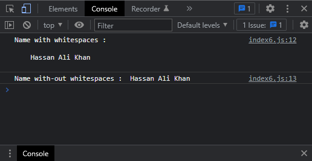

# Exercises No. 6

## Problem Statement:-

- Stripping Names:
  Store a person’s name, and include some whitespace characters at the beginning and end of the name.
  Make sure you use each character combination, "\t" and "\n", at least once.
  Print the name once, so the whitespace around the name is displayed. Then print the name after striping the white spaces.

## Solution:-

- Create a file `index6.js` with the following content

  

- Run the code by using following command in terminal

  ```
  node index6.js
  ```

- Output in the terminal will be as follows

  

- To run the code in the browser create an HTML file `index6.html` and link JS file with it using following piece of code

  ```html
  <script src="./index6.js"></script>
  ```

- Open `index6.html` in browser and navigate to console. Same output can be seen there.

  
