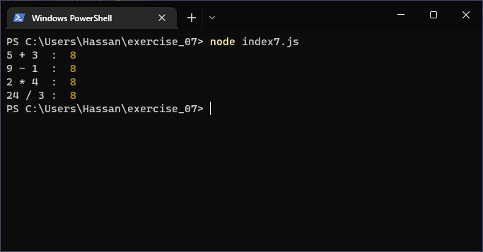

# Exercises No. 7

## Problem Statement:-

- Number Eight:
  Write addition, subtraction, multiplication, and division operations that each result in the number 8.
  Be sure to enclose your operations in print statements to see the results.

## Solution:-

- Create a file `index7.js` with the following content

  

- Run the code by using following command in terminal

  ```
  node index7.js
  ```

- Output in the terminal will be as follows

  

- To run the code in the browser create an HTML file `index7.html` and link JS file with it using following piece of code

  ```html
  <script src="./index7.js"></script>
  ```

- Open `index7.html` in browser and navigate to console. Same output can be seen there.

  
