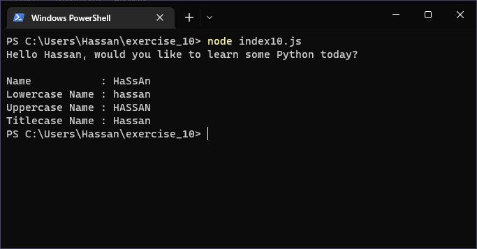

# Exercises No. 10

## Problem Statement:-

- Adding Comments:
  Choose two of the programs you’ve written, and add at least one comment to each.
  If you don’t have anything specific to write because your programs are too simple at this point,
  just add your name and the current date at the top of each program file.
  Then write one sentence describing what the program does.

## Solution:-

- Create a file `index10.js` with the following content

  

- Run the code by using following command in terminal

  ```
  node index10.js
  ```

- Output in the terminal will be as follows

  

- To run the code in the browser create an HTML file `index10.html` and link JS file with it using following piece of code

  ```html
  <script src="./index10.js"></script>
  ```

- Open `index10.html` in browser and navigate to console. Same output can be seen there.

  
