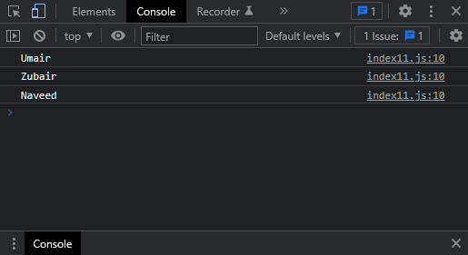

# Exercises No. 11

## Problem Statement:-

- Names:
  Store the names of a few of your friends in a array called names.
  Print each person’s name by accessing each element in the list,
  one at a time.

## Solution:-

- Create a file `index11.js` with the following content

  

- Run the code by using following command in terminal

  ```
  node index11.js
  ```

- Output in the terminal will be as follows

  

- To run the code in the browser create an HTML file `index11.html` and link JS file with it using following piece of code

  ```html
  <script src="./index11.js"></script>
  ```

- Open `index11.html` in browser and navigate to console. Same output can be seen there.

  
