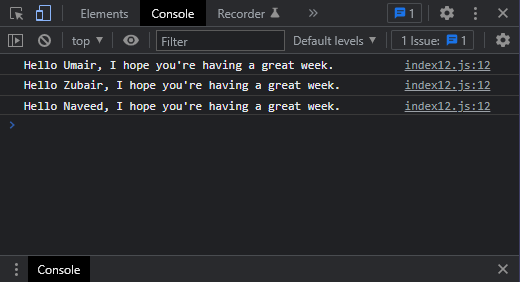

# Exercises No. 12

## Problem Statement:-

- Greetings:
  Start with the array you used in Exercise 11,
  but instead of just printing each person’s name,
  print a message to them.
  The text of each message should be the same,
  but each message should be personalized with the person’s name.

## Solution:-

- Create a file `index12.js` with the following content

  

- Run the code by using following command in terminal

  ```
  node index12.js
  ```

- Output in the terminal will be as follows

  

- To run the code in the browser create an HTML file `index12.html` and link JS file with it using following piece of code

  ```html
  <script src="./index12.js"></script>
  ```

- Open `index12.html` in browser and navigate to console. Same output can be seen there.

  
