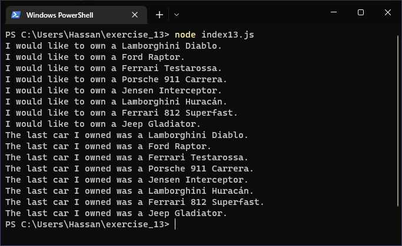
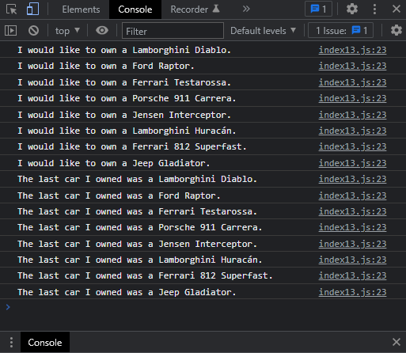

# Exercises No. 13

## Problem Statement:-

- Your Own Array:
  Think of your favorite mode of transportation,
  such as a motorcycle or a car,
  and make a list that stores several examples.
  Use your list to print a series of statements about these items,
  such as “I would like to own a Honda motorcycle.”

## Solution:-

- Create a file `index13.js` with the following content

  

- Run the code by using following command in terminal

  ```
  node index13.js
  ```

- Output in the terminal will be as follows

  

- To run the code in the browser create an HTML file `index13.html` and link JS file with it using following piece of code

  ```html
  <script src="./index13.js"></script>
  ```

- Open `index13.html` in browser and navigate to console. Same output can be seen there.

  
