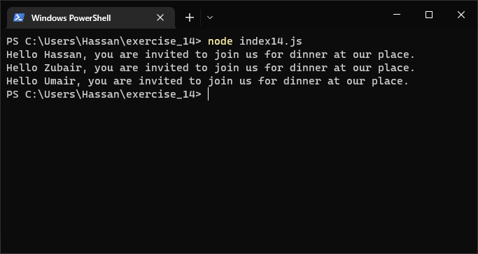
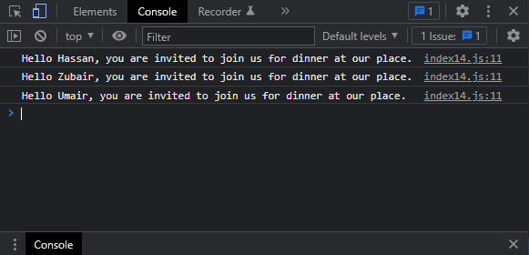

# Exercises No. 14

## Problem Statement:-

- Guest List:
  If you could invite anyone, living or deceased, to dinner,
  who would you invite?
  Make a list that includes at least three people you’d like to invite to dinner.
  Then use your list to print a message to each person, inviting them to dinner.

## Solution:-

- Create a file `index14.js` with the following content

  

- Run the code by using following command in terminal

  ```
  node index14.js
  ```

- Output in the terminal will be as follows

  

- To run the code in the browser create an HTML file `index14.html` and link JS file with it using following piece of code

  ```html
  <script src="./index14.js"></script>
  ```

- Open `index14.html` in browser and navigate to console. Same output can be seen there.

  
