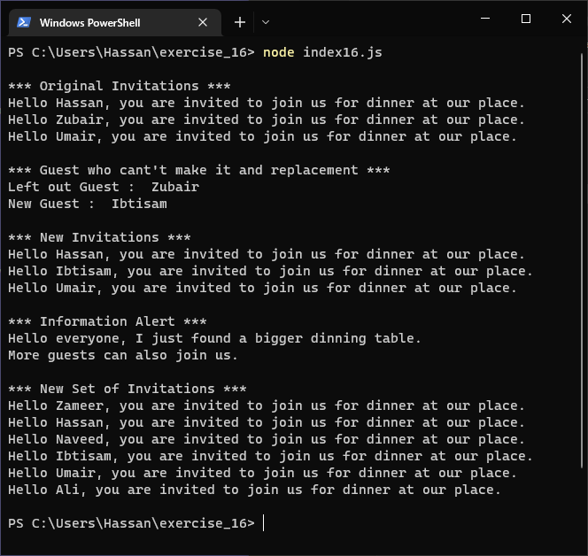
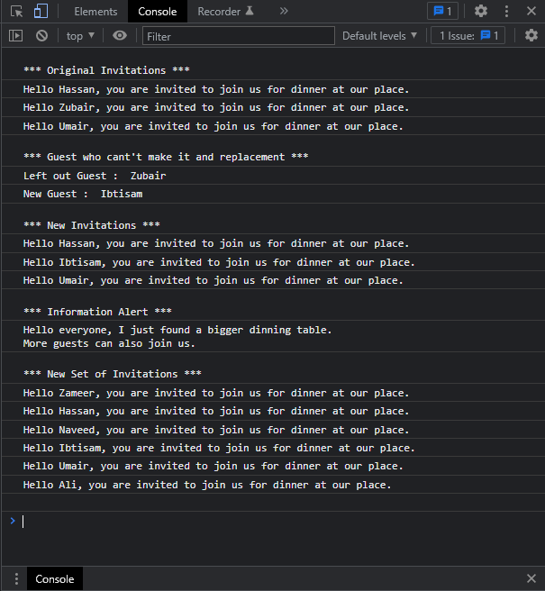

# Exercises No. 16

## Problem Statement:-

- More Guests:
  You just found a bigger dinner table, so now more space is available.
  Think of three more guests to invite to dinner.
  - Start with your program from Exercise 15.
    Add a print statement to the end of your program
    informing people that you found a bigger dinner table.
  - Add one new guest to the beginning of your array.
  - Add one new guest to the middle of your array.
  - Use append() to add one new guest to the end of your list.
  - Print a new set of invitation messages, one for each person in your list.

## Solution:-

- Create a file `index16.js` with the following content

  

- Run the code by using following command in terminal

  ```
  node index16.js
  ```

- Output in the terminal will be as follows

  

- To run the code in the browser create an HTML file `index16.html` and link JS file with it using following piece of code

  ```html
  <script src="./index16.js"></script>
  ```

- Open `index16.html` in browser and navigate to console. Same output can be seen there.

  
