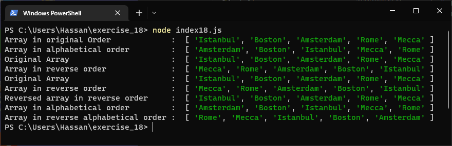

# Exercises No. 18

## Problem Statement:-

- Seeing the World
  Think of at least five places in the world you’d like to visit.
  - Store the locations in a array. Make sure the array is not in alphabetical order.
  - Print your array in its original order.
  - Print your array in alphabetical order without modifying the actual list.
  - Show that your array is still in its original order by printing it.
  - Print your array in reverse alphabetical order without changing the order of the original list.
  - Show that your array is still in its original order by printing it again.
  - Reverse the order of your list. Print the array to show that its order has changed.
  - Reverse the order of your list again. Print the list to show it’s back to its original order.
  - Sort your array so it’s stored in alphabetical order. Print the array to show that its order has been changed.
  - Sort to change your array so it’s stored in reverse alphabetical order.
    Print the list to show that its order has changed.

## Solution:-

- Create a file `index18.js` with the following content

  

- Run the code by using following command in terminal

  ```
  node index18.js
  ```

- Output in the terminal will be as follows

  

- To run the code in the browser create an HTML file `index18.html` and link JS file with it using following piece of code

  ```html
  <script src="./index18.js"></script>
  ```

- Open `index18.html` in browser and navigate to console. Same output can be seen there.

  
