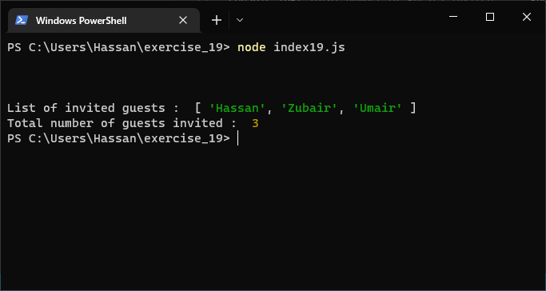
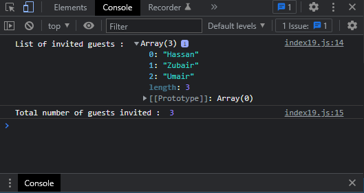

# Exercises No. 19

## Problem Statement:-

-Dinner Guests:
Working with one of the programs from Exercises 14 through 18,
print a message indicating the number of people you are inviting to dinner.

## Solution:-

- Create a file `index19.js` with the following content

  

- Run the code by using following command in terminal

  ```
  node index19.js
  ```

- Output in the terminal will be as follows

  

- To run the code in the browser create an HTML file `index19.html` and link JS file with it using following piece of code

  ```html
  <script src="./index19.js"></script>
  ```

- Open `index19.html` in browser and navigate to console. Same output can be seen there.

  
