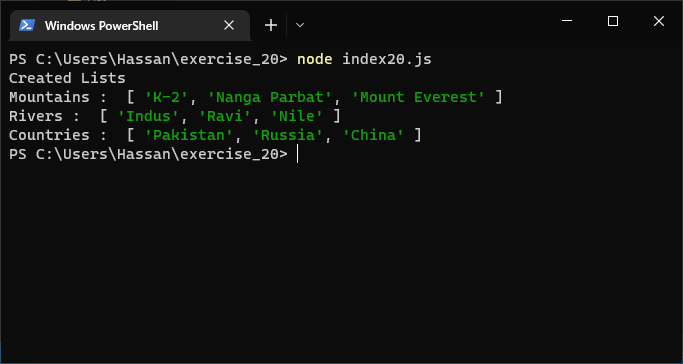
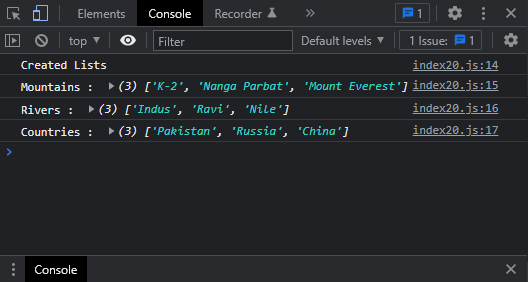

# Exercises No. 20

## Problem Statement:-

- List:
  Think of something you could store in a array.
  For example, you could make a list of
  mountains, rivers, countries, cities, languages, or anything
  else you’d like.
  Write a program that creates a list containing these items.

## Solution:-

- Create a file `index20.js` with the following content

  

- Run the code by using following command in terminal

  ```
  node index20.js
  ```

- Output in the terminal will be as follows

  

- To run the code in the browser create an HTML file `index20.html` and link JS file with it using following piece of code

  ```html
  <script src="./index20.js"></script>
  ```

- Open `index20.html` in browser and navigate to console. Same output can be seen there.

  
