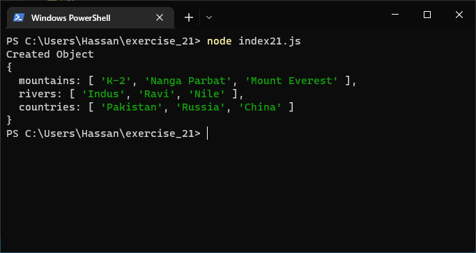

# Exercises No. 21

## Problem Statement:-

- Objects:
  They think of something you could store in a JavaScript Object.
  Write a program that creates Objects containing these items.

## Solution:-

- Create a file `index21.js` with the following content

  

- Run the code by using following command in terminal

  ```
  node index21.js
  ```

- Output in the terminal will be as follows

  

- To run the code in the browser create an HTML file `index21.html` and link JS file with it using following piece of code

  ```html
  <script src="./index21.js"></script>
  ```

- Open `index21.html` in browser and navigate to console. Same output can be seen there.

  
