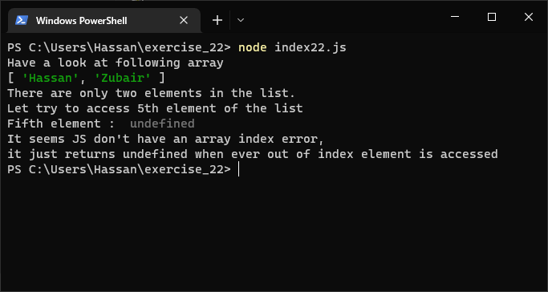

# Exercises No. 22

## Problem Statement:-

- Intentional Error:
  If you haven’t received an array index error in one of your programs yet,
  try to make one happen. Change an index in one of your programs
  to produce an index error.
  Make sure you correct the error before closing the program.

## Solution:-

- Create a file `index22.js` with the following content

  

- Run the code by using following command in terminal

  ```
  node index22.js
  ```

- Output in the terminal will be as follows

  

- To run the code in the browser create an HTML file `index22.html` and link JS file with it using following piece of code

  ```html
  <script src="./index22.js"></script>
  ```

- Open `index22.html` in browser and navigate to console. Same output can be seen there.

  
