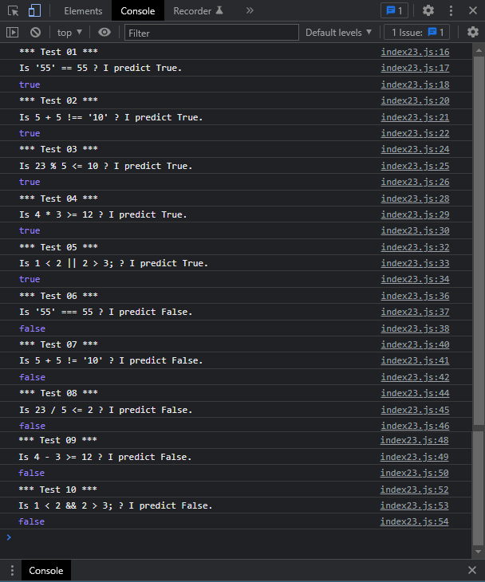

# Exercises No. 23

## Problem Statement:-

- Conditional Tests:
  Write a series of conditional tests.
  Print a statement describing each test and your prediction
  for the results of each test.
  Your code should look something like this:
  ```
  let car = 'subaru';
  console.log("Is car == 'subaru'? I predict True.")
  console.log(car == 'subaru')
  ```
  - Look closely at your results, and make sure you understand
    why each line evaluates to True or False.
  - Create at least 10 tests. Have at least 5 tests evaluate to
    True and another 5 tests evaluate to False.

## Solution:-

- Create a file `index23.js` with the following content

  

- Run the code by using following command in terminal

  ```
  node index23.js
  ```

- Output in the terminal will be as follows

  

- To run the code in the browser create an HTML file `index23.html` and link JS file with it using following piece of code

  ```html
  <script src="./index23.js"></script>
  ```

- Open `index23.html` in browser and navigate to console. Same output can be seen there.

  
