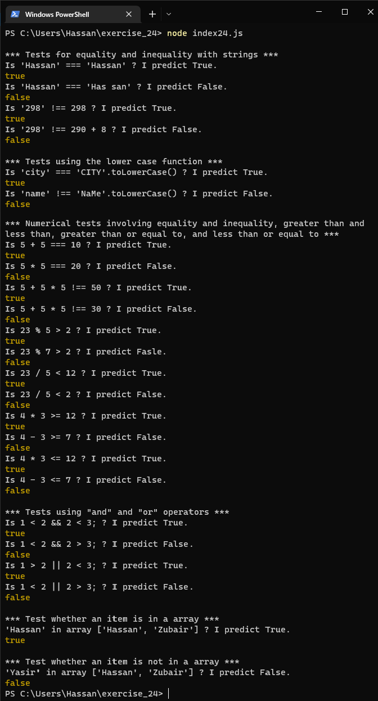
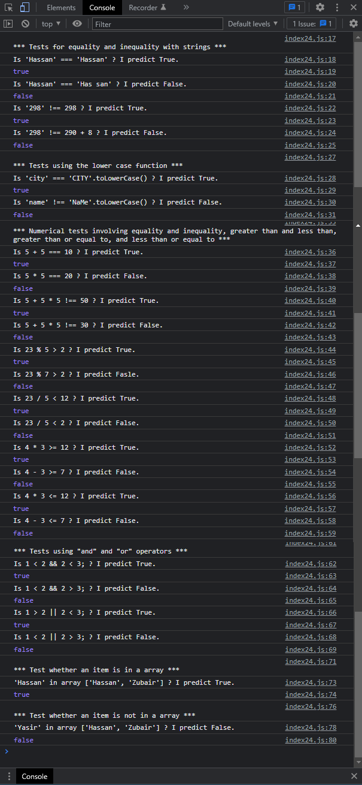

# Exercises No. 24

## Problem Statement:-

- More Conditional Tests:
  You don’t have to limit the number of tests you create to 10.
  If you want to try more comparisons, write more tests.
  Have at least one True and one False result for each of the following:
  - Tests for equality and inequality with strings
  - Tests using the lower case function
  - Numerical tests involving equality and inequality,
    greater than and less than,
    greater than or equal to,
    and less than or equal to
  - Tests using "and" and "or" operators
  - Test whether an item is in a array
  - Test whether an item is not in a array

## Solution:-

- Create a file `index24.js` with the following content

  

- Run the code by using following command in terminal

  ```
  node index24.js
  ```

- Output in the terminal will be as follows

  

- To run the code in the browser create an HTML file `index24.html` and link JS file with it using following piece of code

  ```html
  <script src="./index24.js"></script>
  ```

- Open `index24.html` in browser and navigate to console. Same output can be seen there.

  
