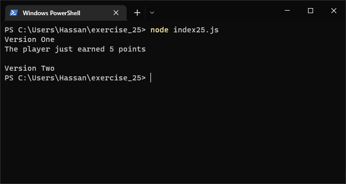
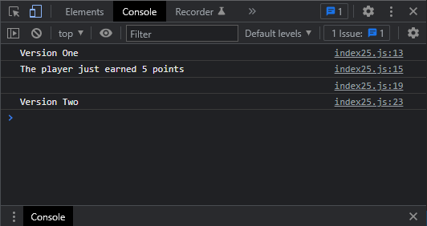

# Exercises No. 25

## Problem Statement:-

- Alien Colors #1:
  Imagine an alien was just shot down in a game.
  Create a variable called alien_color and assign it a value of 'green', 'yellow', or 'red'.
  - Write an if statement to test whether the alien’s color is green.
    If it is, print a message that the player just earned 5 points.
  - Write one version of this program that passes the if test and another that
    fails. (The version that fails will have no output.)

## Solution:-

- Create a file `index25.js` with the following content

  

- Run the code by using following command in terminal

  ```
  node index25.js
  ```

- Output in the terminal will be as follows

  

- To run the code in the browser create an HTML file `index25.html` and link JS file with it using following piece of code

  ```html
  <script src="./index25.js"></script>
  ```

- Open `index25.html` in browser and navigate to console. Same output can be seen there.

  
