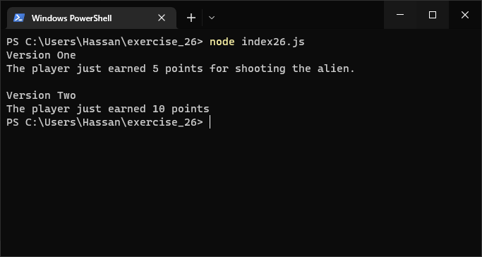
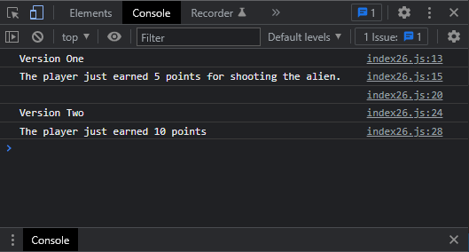

# Exercises No. 26

## Problem Statement:-

- Alien Colors #2:
  Choose a color for an alien as you did in Exercise 25,
  andwrite an if-else chain.
  - If the alien’s color is green,
    print a statement that the player just earned 5 points for shooting the alien.
  - If the alien’s color isn’t green, print a statement that the player just earned 10 points.
  - Write one version of this program that runs the if block and another that runs the else block."

## Solution:-

- Create a file `index26.js` with the following content

  

- Run the code by using following command in terminal

  ```
  node index26.js
  ```

- Output in the terminal will be as follows

  

- To run the code in the browser create an HTML file `index26.html` and link JS file with it using following piece of code

  ```html
  <script src="./index26.js"></script>
  ```

- Open `index26.html` in browser and navigate to console. Same output can be seen there.

  
