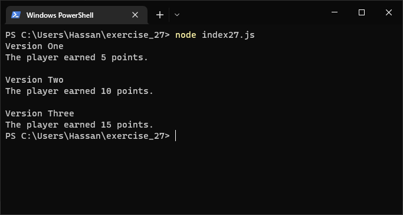
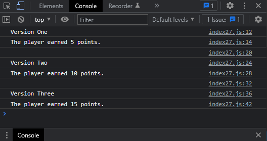

# Exercises No. 27

## Problem Statement:-

- Alien Colors #3:
  Turn your if-else chain from Exercise 5-4 into an if-else chain.
  - If the alien is green, print a message that the player earned 5 points.
  - If the alien is yellow, print a message that the player earned 10 points.
  - If the alien is red, print a message that the player earned 15 points.
  - Write three versions of this program, making sure each message is printed for the appropriate color alien.

## Solution:-

- Create a file `index27.js` with the following content

  

- Run the code by using following command in terminal

  ```
  node index27.js
  ```

- Output in the terminal will be as follows

  

- To run the code in the browser create an HTML file `index27.html` and link JS file with it using following piece of code

  ```html
  <script src="./index27.js"></script>
  ```

- Open `index27.html` in browser and navigate to console. Same output can be seen there.

  
