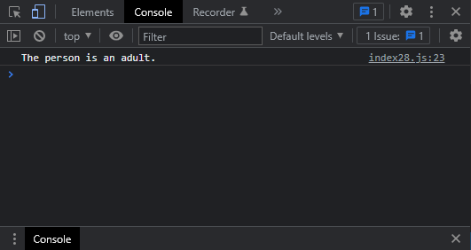

# Exercises No. 28

## Problem Statement:-

- Stages of Life:
  Write an if-else chain that determines a person’s stage of life.
  Set a value for the variable age, and then:
  - If the person is less than 2 years old, print a message that the person is a baby.
  - If the person is at least 2 years old but less than 4, print a message that the person is a toddler.
  - If the person is at least 4 years old but less than 13, print a message that the person is a kid.
  - If the person is at least 13 years old but less than 20, print a message that the person is a teenager.
  - If the person is at least 20 years old but less than 65, print a message that the person is an adult.
  - If the person is age 65 or older, print a message that the person is an elder.

## Solution:-

- Create a file `index28.js` with the following content

  

- Run the code by using following command in terminal

  ```
  node index28.js
  ```

- Output in the terminal will be as follows

  

- To run the code in the browser create an HTML file `index28.html` and link JS file with it using following piece of code

  ```html
  <script src="./index28.js"></script>
  ```

- Open `index28.html` in browser and navigate to console. Same output can be seen there.

  
