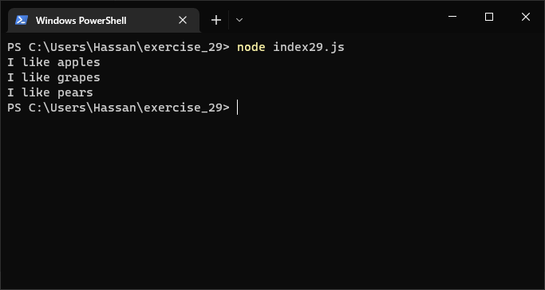

# Exercises No. 29

## Problem Statement:-

- Favorite Fruit:
  Make a array of your favorite fruits,
  and then write a series of independent if statements that check for certain fruits in your array.
  - Make a array of your three favorite fruits and call it favorite_fruits.
  - Write five if statements.
    Each should check whether a certain kind of fruit is in your array.
    If the fruit is in your array, the if block should print a statement,
    such as You really like bananas!

## Solution:-

- Create a file `index29.js` with the following content

  

- Run the code by using following command in terminal

  ```
  node index29.js
  ```

- Output in the terminal will be as follows

  

- To run the code in the browser create an HTML file `index29.html` and link JS file with it using following piece of code

  ```html
  <script src="./index29.js"></script>
  ```

- Open `index29.html` in browser and navigate to console. Same output can be seen there.

  
