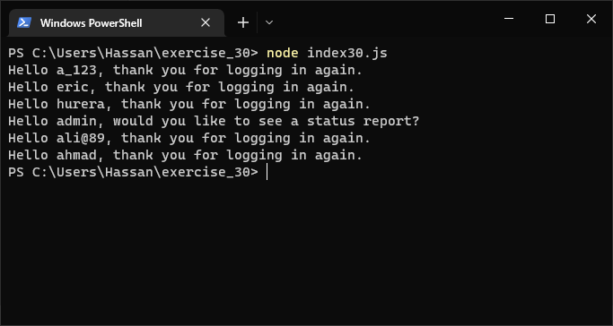
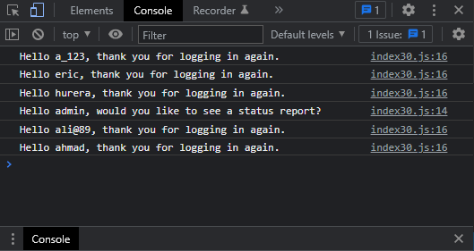

# Exercises No. 30

## Problem Statement:-

- Hello Admin:
  Make a array of five or more usernames, including the name 'admin'.
  Imagine you are writing code that will print a greeting to each user
  after they log in to a website.
  Loop through the array, and print a greeting to each user:
  - If the username is 'admin', print a special greeting, such as Hello admin, would you like to see a status report?
  - Otherwise, print a generic greeting, such as Hello Eric, thank you for logging in again.

## Solution:-

- Create a file `index30.js` with the following content

  

- Run the code by using following command in terminal

  ```
  node index30.js
  ```

- Output in the terminal will be as follows

  

- To run the code in the browser create an HTML file `index30.html` and link JS file with it using following piece of code

  ```html
  <script src="./index30.js"></script>
  ```

- Open `index30.html` in browser and navigate to console. Same output can be seen there.

  
