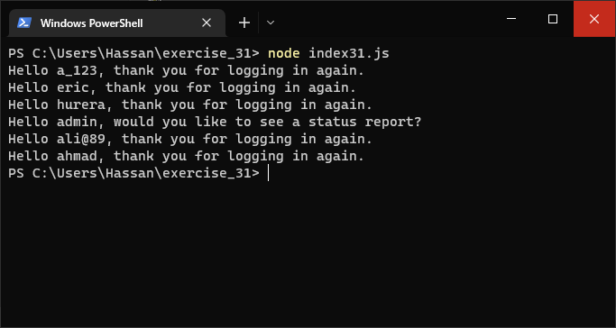
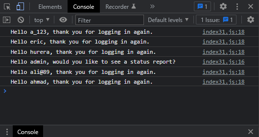

# Exercises No. 31

## Problem Statement:-

- No Users:
  Add an if test to Exercise 28 to make sure the list of users is not empty.
  - If the list is empty, print the message We need to find some users!
  - Remove all of the usernames from your array, and make sure the correct message is printed.

## Solution:-

- Create a file `index31.js` with the following content

  

- Run the code by using following command in terminal

  ```
  node index31.js
  ```

- Output in the terminal will be as follows

  

- To run the code in the browser create an HTML file `index31.html` and link JS file with it using following piece of code

  ```html
  <script src="./index31.js"></script>
  ```

- Open `index31.html` in browser and navigate to console. Same output can be seen there.

  
