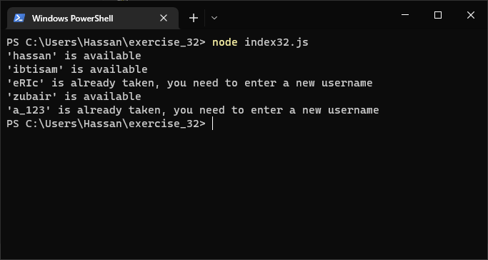
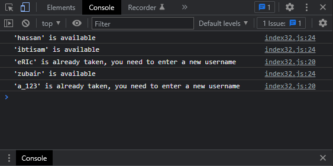

# Exercises No. 32

## Problem Statement:-

- Checking Usernames:
  Do the following to create a program that simulates
  how websites ensure that everyone has a unique username.
  - Make a list of five or more usernames called current_users.
  - Make another list of five usernames called new_users.
    Make sure one or two of the new usernames are also in the current_users list.
  - Loop through the new_users list to see if each new username has already been used.
    If it has, print a message that the person will need to enter a
    new username.
    If a username has not been used, print a message saying that the username is available.
  - Make sure your comparison is case insensitive. If 'John' has been used, 'JOHN' should not be accepted.

## Solution:-

- Create a file `index32.js` with the following content

  

- Run the code by using following command in terminal

  ```
  node index32.js
  ```

- Output in the terminal will be as follows

  

- To run the code in the browser create an HTML file `index32.html` and link JS file with it using following piece of code

  ```html
  <script src="./index32.js"></script>
  ```

- Open `index32.html` in browser and navigate to console. Same output can be seen there.

  
