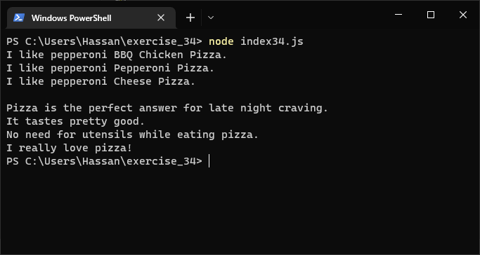
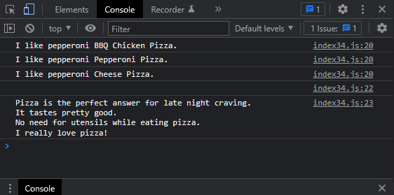

# Exercises No. 34

## Problem Statement:-

- Pizzas:
  Think of at least three kinds of your favorite pizza.
  Store these pizza names in a array,
  and then use a for loop to print the name of each pizza.
  - Modify your for loop to print a sentence using the name of the pizza
    instead of printing just the name of the pizza. For each pizza you should
    have one line of output containing a simple statement like I like pepperoni
    pizza.
  - Add a line at the end of your program, outside the for loop, that states
    how much you like pizza. The output should consist of three or more lines
    about the kinds of pizza you like and then an additional sentence, such as
    I really love pizza!

## Solution:-

- Create a file `index34.js` with the following content

  

- Run the code by using following command in terminal

  ```
  node index34.js
  ```

- Output in the terminal will be as follows

  

- To run the code in the browser create an HTML file `index34.html` and link JS file with it using following piece of code

  ```html
  <script src="./index34.js"></script>
  ```

- Open `index34.html` in browser and navigate to console. Same output can be seen there.

  
