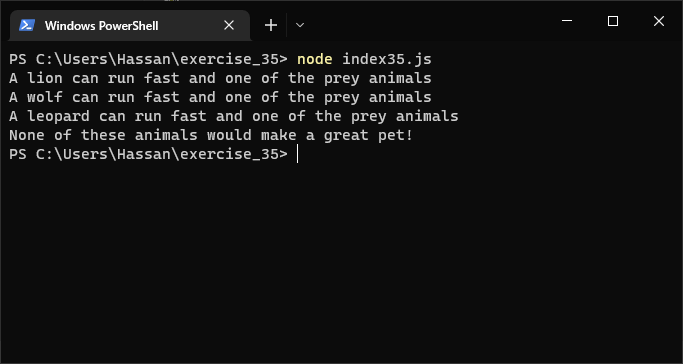
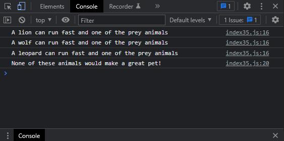

# Exercises No. 35

## Problem Statement:-

- Animals:
  Think of at least three different animals that have a common characteristic.
  Store the names of these animals in a list, and then use a for loop to print
  out the name of each animal.
  - Modify your program to print a statement about each animal, such as
    A dog would make a great pet.
  - Add a line at the end of your program stating what these animals have in
    common. You could print a sentence such as Any of these animals would
    make a great pet!

## Solution:-

- Create a file `index35.js` with the following content

  

- Run the code by using following command in terminal

  ```
  node index35.js
  ```

- Output in the terminal will be as follows

  

- To run the code in the browser create an HTML file `index35.html` and link JS file with it using following piece of code

  ```html
  <script src="./index35.js"></script>
  ```

- Open `index35.html` in browser and navigate to console. Same output can be seen there.

  
