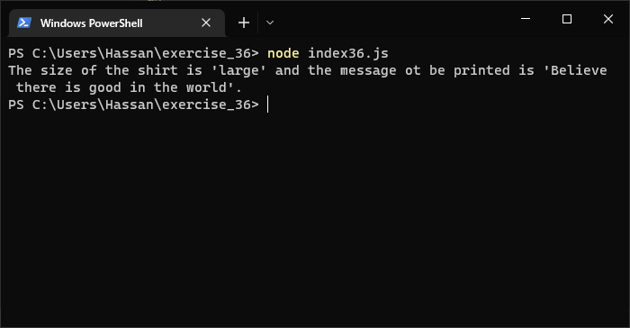

# Exercises No. 36

## Problem Statement:-

- T-Shirt:
  Write a function called make_shirt() that accepts a size and the
  text of a message that should be printed on the shirt.
  The function should print a sentence summarizing the size of the shirt
  and the message printed on it.
  Call the function.

## Solution:-

- Create a file `index36.js` with the following content

  

- Run the code by using following command in terminal

  ```
  node index36.js
  ```

- Output in the terminal will be as follows

  

- To run the code in the browser create an HTML file `index36.html` and link JS file with it using following piece of code

  ```html
  <script src="./index36.js"></script>
  ```

- Open `index36.html` in browser and navigate to console. Same output can be seen there.

  
