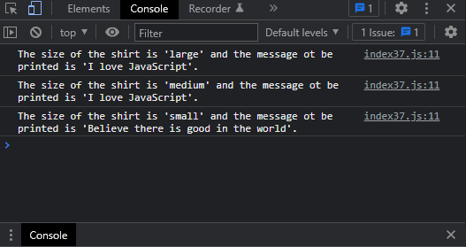

# Exercises No. 37

## Problem Statement:-

- Large Shirts:
  Modify the make_shirt() function so that
  shirts are large by default with a message that reads I love JavaScript.
  Make a large shirt and a medium shirt with the default message,
  and a shirt of any size with a different
  message.

## Solution:-

- Create a file `index37.js` with the following content

  

- Run the code by using following command in terminal

  ```
  node index37.js
  ```

- Output in the terminal will be as follows

  

- To run the code in the browser create an HTML file `index37.html` and link JS file with it using following piece of code

  ```html
  <script src="./index37.js"></script>
  ```

- Open `index37.html` in browser and navigate to console. Same output can be seen there.

  
