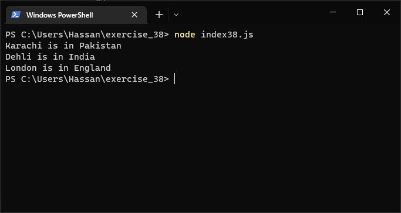
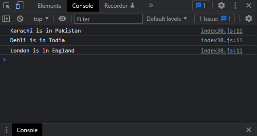

# Exercises No. 38

## Problem Statement:-

- Cities:
  Write a function called describe_city() that accepts the name of a city and its country.
  The function should print a simple sentence, such as Karachi is in Pakistan.
  Give the parameter for the country a default value.
  Call your function for three different cities,
  at least one of which is not in the default country.

## Solution:-

- Create a file `index38.js` with the following content

  

- Run the code by using following command in terminal

  ```
  node index38.js
  ```

- Output in the terminal will be as follows

  

- To run the code in the browser create an HTML file `index38.html` and link JS file with it using following piece of code

  ```html
  <script src="./index38.js"></script>
  ```

- Open `index38.html` in browser and navigate to console. Same output can be seen there.

  
