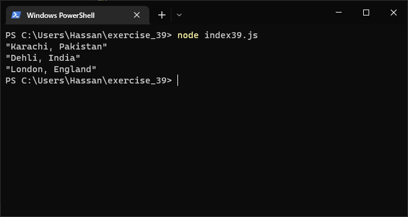

# Exercises No. 39

## Problem Statement:-

- City Names:
  Write a function called city_country() that takes in the name
  of a city and its country. The function should return a string formatted like this:
  "Lahore, Pakistan"
  Call your function with at least three city-country pairs, and print the value
  that’s returned.

## Solution:-

- Create a file `index39.js` with the following content

  

- Run the code by using following command in terminal

  ```
  node index39.js
  ```

- Output in the terminal will be as follows

  

- To run the code in the browser create an HTML file `index39.html` and link JS file with it using following piece of code

  ```html
  <script src="./index39.js"></script>
  ```

- Open `index39.html` in browser and navigate to console. Same output can be seen there.

  
