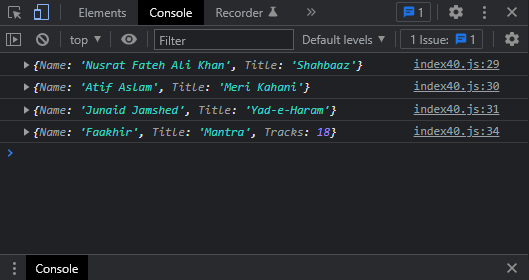

# Exercises No. 40

## Problem Statement:-

- Album:
  Write a function called make_album() that builds a Object describing a music album.
  The function should take in an artist name and an album title,
  and it should return a Object containing these two pieces of
  information.
  Use the function to make three dictionaries representing different albums.
  Print each return value to show that Objects are storing the album information correctly.
  Add an optional parameter to make_album() that allows you to store the
  number of tracks on an album. If the calling line includes a value for the number
  of tracks, add that value to the album’s Object. Make at least one new
  function call that includes the number of tracks on an album.

## Solution:-

- Create a file `index40.js` with the following content

  

- Run the code by using following command in terminal

  ```
  node index40.js
  ```

- Output in the terminal will be as follows

  

- To run the code in the browser create an HTML file `index40.html` and link JS file with it using following piece of code

  ```html
  <script src="./index40.js"></script>
  ```

- Open `index40.html` in browser and navigate to console. Same output can be seen there.

  
