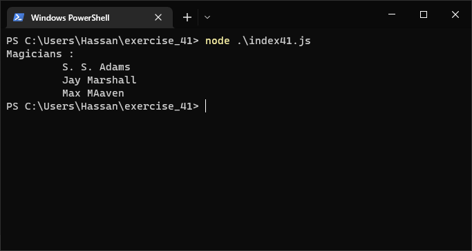
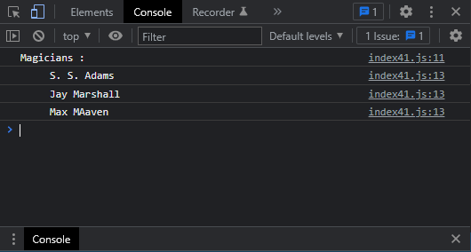

# Exercises No. 41

## Problem Statement:-

- Magicians:
  Make a array of magician’s names.
  Pass the array to a function called show_magicians(),
  which prints the name of each magician in the array.

## Solution:-

- Create a file `index41.js` with the following content

  

- Run the code by using following command in terminal

  ```
  node index41.js
  ```

- Output in the terminal will be as follows

  

- To run the code in the browser create an HTML file `index41.html` and link JS file with it using following piece of code

  ```html
  <script src="./index41.js"></script>
  ```

- Open `index41.html` in browser and navigate to console. Same output can be seen there.

  
