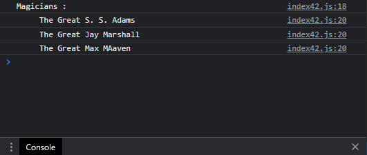

# Exercises No. 42

## Problem Statement:-

- Great Magicians:
  Start with a copy of your program from Exercise 39.
  Write a function called make_great() that modifies the array of magicians by adding
  the phrase the Great to each magician’s name.
  Call show_magicians() to see that the list has actually been modified.

## Solution:-

- Create a file `index42.js` with the following content

  

- Run the code by using following command in terminal

  ```
  node index42.js
  ```

- Output in the terminal will be as follows

  

- To run the code in the browser create an HTML file `index42.html` and link JS file with it using following piece of code

  ```html
  <script src="./index42.js"></script>
  ```

- Open `index42.html` in browser and navigate to console. Same output can be seen there.

  
