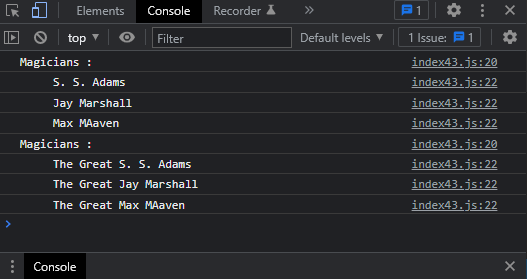

# Exercises No. 43

## Problem Statement:-

- Unchanged Magicians:
  Start with your work from Exercise 40.
  Call the function make_great() with a copy of the array of magicians’ names.
  Because the original array will be unchanged, return the new array and store it in a separate array.
  Call show_magicians() with each array to show that you have one array of the original
  names and one array with the Great added to each magician’s name.

## Solution:-

- Create a file `index43.js` with the following content

  

- Run the code by using following command in terminal

  ```
  node index43.js
  ```

- Output in the terminal will be as follows

  

- To run the code in the browser create an HTML file `index43.html` and link JS file with it using following piece of code

  ```html
  <script src="./index43.js"></script>
  ```

- Open `index43.html` in browser and navigate to console. Same output can be seen there.

  
