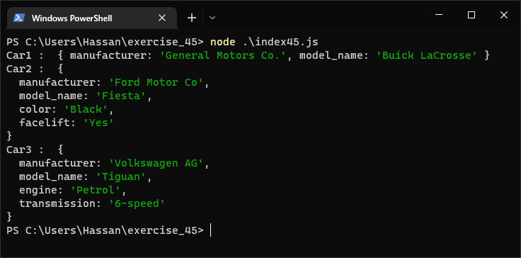

# Exercises No. 45

## Problem Statement:-

- Cars:
  Write a function that stores information about a car in a Object.
  The function should always receive a manufacturer and a model name. It
  should then accept an arbitrary number of keyword arguments. Call the function
  with the required information and two other name-value pairs, such as a
  color or an optional feature.
  Print the Object that’s returned to make sure all the information was
  stored correctly.

## Solution:-

- Create a file `index45.js` with the following content

  

- Run the code by using following command in terminal

  ```
  node index45.js
  ```

- Output in the terminal will be as follows

  

- To run the code in the browser create an HTML file `index45.html` and link JS file with it using following piece of code

  ```html
  <script src="./index45.js"></script>
  ```

- Open `index45.html` in browser and navigate to console. Same output can be seen there.

  
